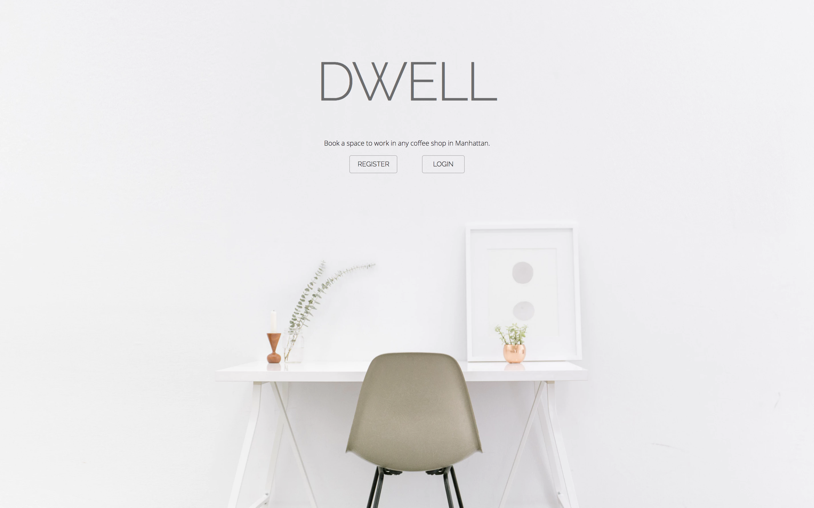
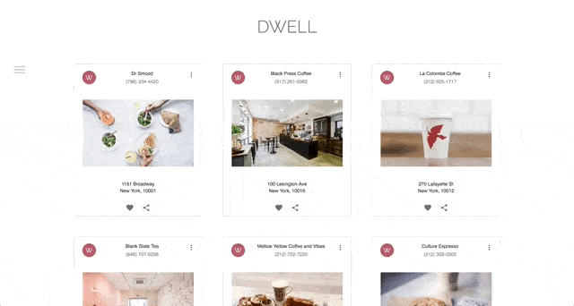
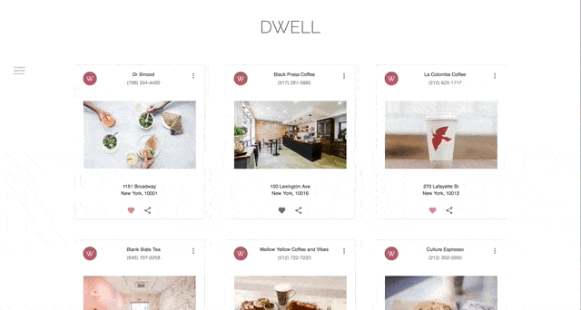
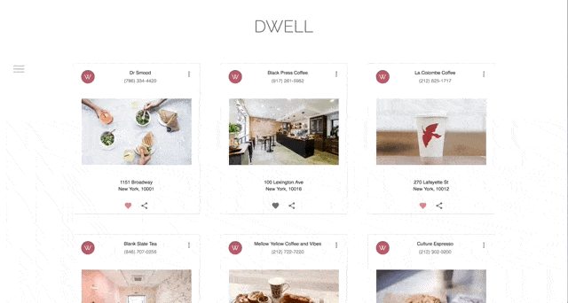
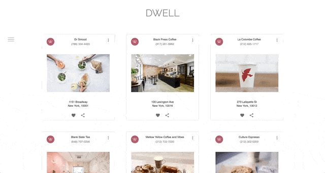
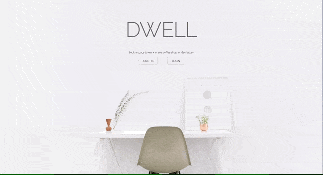
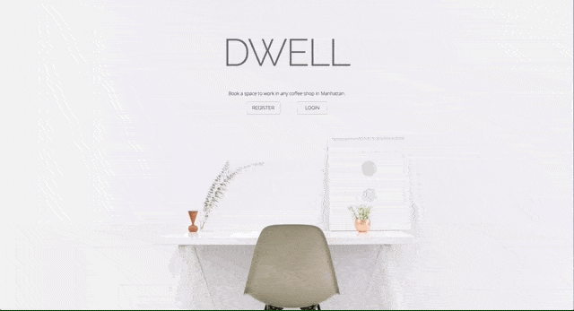

# Dwell

## Description
This is a demo for Dwell, an application built upon a React/Redux front end and Ruby on Rails back end. Dwell allows users to book an hour-long workspace to maximize productivity at any WiFi cafe in Manhattan.

**The live application can be found [here](https://dwell-here.herokuapp.com/).**

## Core Features
1. [Display of Existing Cafes in Manhattan](#display-of-exisiting-cafes-in-manhattan)
2. [Ability to Book a Workspace](#ability-to-book-a-workspace)
3. [Compiled User Booking History](#compiled-user-booking-history)
4. [Yelp Integration](#yelp-integration)
5. [Create and View Favorite Workspaces](#create-and-view-favorite-workspaces)
6. [User Authentication and Authorization](#user-authentication-and-authorization)
7. [Dynamic Routing](#dynamic-routing)

### Display Existing Cafes in Manhattan
After a user has logged in and been authenticated, the user will be greeted with the home page of Dwell which displays all of the currently existing cafes in Manhattan. Cafes are rendered with details including the address and phone number.

### Ability to Book a Workspace
Following user authentication and authorization, a user can click on the button inside each detail of the workspace to open a modal which will render a form that prompts the user to pick a date as well as a start and end time for the booking. Following the confirmation, the contents of the modal are replaced with a message to confirm that the booking has been persisted.  

### Compiled User Booking History
Using the hidden menu bar, a user can toggle in the menu bar and click on the "Bookings" URL, which will redirect the user to the page that will display all of the past and upcoming bookings the user has at all of the workspaces in the database.

### Yelp Integration
The entire database of workspaces is compiled from a request to the Yelp API for a query encompassing all of the cafes in Manhattan with WiFi. Furthermore, if the user would like more details about the workspace, there is a redirect button included with each cafe that will open a new tab to the show page for that cafe at www.yelp.com.

### Create and View Favorite Workspaces
Different than booking a workspace, the user has the ability to favorite a workspace to keep track of all the visited cafes or cafes the user is looking to visit. These favorited workspaces will persist to the backend and render even on page refresh.

### User Authentication and Authorization
A user with an existing account can follow the prompt to log in on the root page and login with the credentials matching their existing account. Should the user attempt to login with the incorrect username or password, the user will be alerted that they have attempted invalid login credentials and be redirected to the root page.  

Should a user of the application not yet have an account, they can follow the prompt to register for an account and follow the form guidelines instead. Upon account creation, the user will be redirected to the login page to be authenticated and authorized with their new credentials.

### Dynamic Routing
The menu at the side of the home page has links to various pages in the application, including a page for all the workspaces and a page for all of the bookings. All links will change the URL in the browser and render the component that matches that path. If a user is done with their interaction of the application, they can click the logout button to clear their session and are immediately redirected to the root page.

